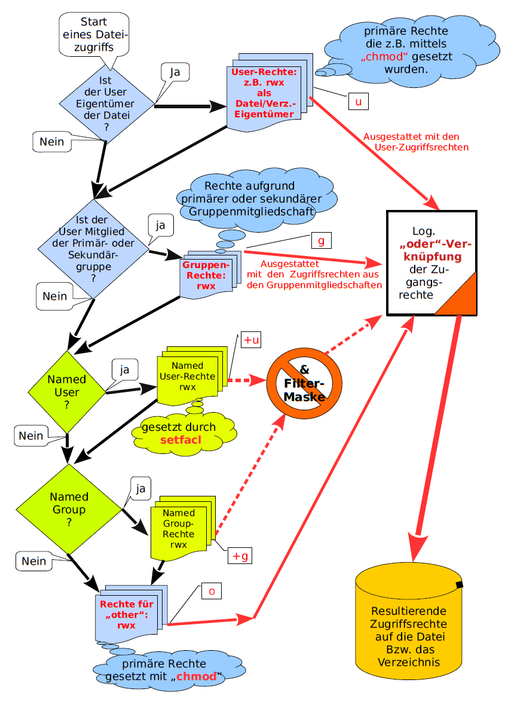

# ACL

`touch hallo.txt`

`ls -l`

ersten drei die besitzer

zweiter named gruppe

die nächsten drei sind Other

`+` bedeute das es eine ACL gibt

`getfacl --all-effective [DAIEI]` um acl abzufragen

Liste mit user rechten

-m #modify

:rwx # read write execute

`setfacl -m u:[USER]:rwx [DATEI]`

warum effektiv

weil es noch eine maske gibt und das und verküpft ist und somit beides da sein muss

maske setzen

`setfacl -m m:-rx [DATEI]`

jetzt hat er

für das verzeichnis und alle unterverzeichnis

`setfacl -Rm m:-rx .\`

für alle user

`setfacl -m u:*rwx [DATEI]`

`chmod u+rwx [Datei]`

keine read mehr

`chmod u-555 [Datei]`

read 
write
execute

|                               |chmod (octal)  |umask (octal)  |Symbolisch |Binär|
|--|--|--|--|--|--|
|Lesen, schreiben und ausführen |7              |0              |rwx        |111|
|Lesen und Schreiben            |6              |1              |rw-        |110|
|Lesen und Ausführen            |5              |2              |r-x        |101|
|Nur lesen                      |4              |3              |r--        |100|
|Schreiben und Ausführen        |3              |4              |-wx        |011|
|Nur Schreiben                  |2              |5              |-w-        |010|
|Nur Ausführen                  |1              |6              |--x        |001|
|Keine Rechte                   |0              |7              |–--        |000|

sekundäre und primäre gruppe

sekundär an anderen als sekundäre angehängt hat also auch die recht die der user hat an den angehängt

## Grafik

1. user/besitzer
2. primär und sekundär gruppen
3. named user
4. named groups
5. alle anderen

BLAU ALT

GELB NEU

`setfacl`, `getfacl`
